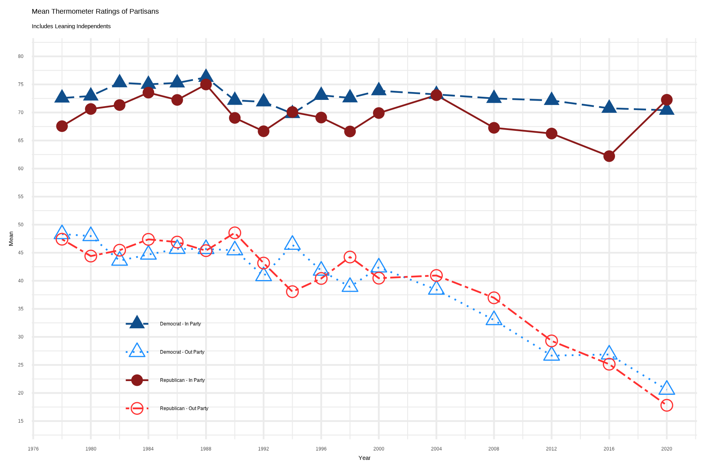

# It's Cold Outside, it's Chilly Inside: Declining In-Party Affect

Recent scholarship has challenged the notion that partisans are uniformly warm toward their co-partisans (e.g.,  [Klar, Krupnikov, and Ryan 2018](https://academic.oup.com/poq/article-abstract/82/2/379/4996003)), and suggested that out-party animus not in-party allegiance is the primary motivator of partisan voting behavior ([Iyengar & Krupenkin, 2018](https://onlinelibrary.wiley.com/doi/full/10.1111/pops.12487)). 

This working project describes how variation in in-party affect has increased alongside declining average feeling thermometers, and a rising proportion of Americans who are cold towards both parties.

This project is in-progress; figures and findings are not final.

## Since 2004, average in-party therms have declined, though are still relatively high

## In-party feeling thermometer standard deviation has also seen a modest increase since 2004

## Looking at the mean partisan feeling thermometer of all respondents, the shift from warm to cold is especially apparent

## Cold partisans are pessimistic, but not necessarily disengaged, they participate at similar rates, but are less likely to support their party's candidates.

