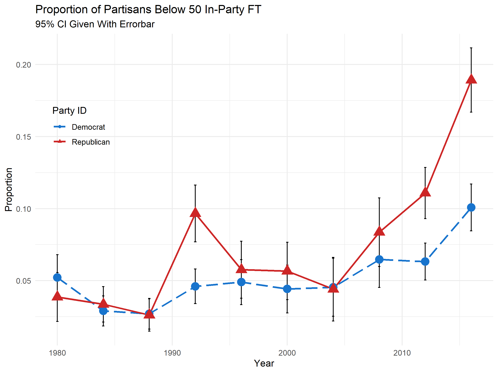
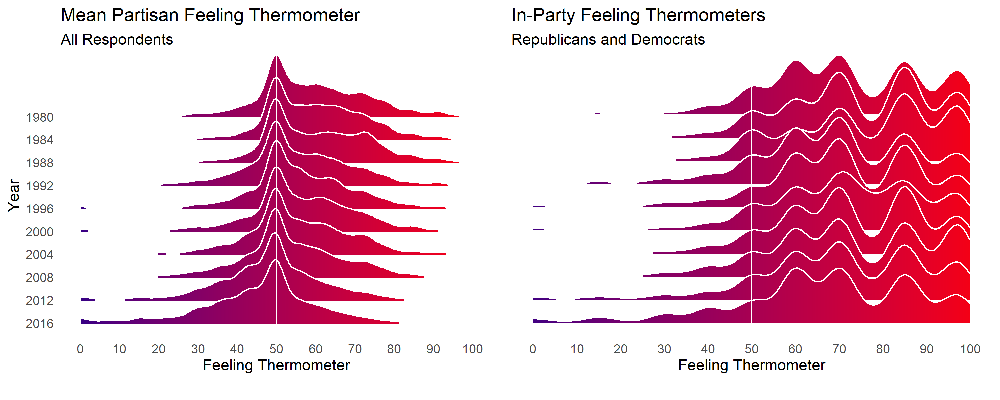
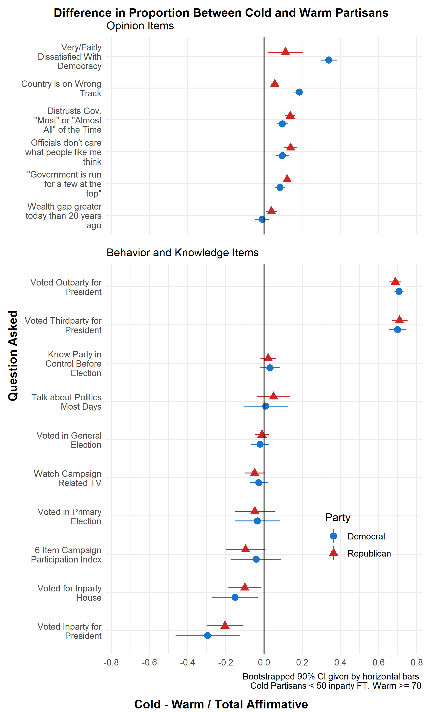
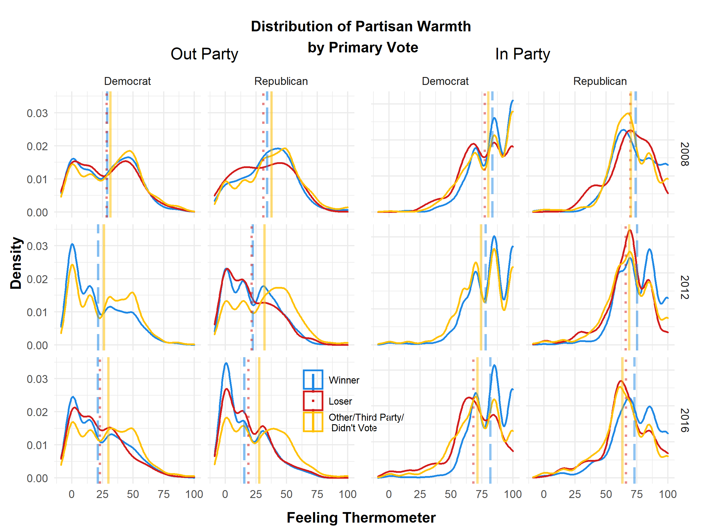

```{r setup, include=FALSE}
knitr::opts_chunk$set(echo = TRUE)
library(tidyverse) #tidyverse
library(kableExtra) # one way to make tables
library(stargazer) # Another way to make tables (can also output esttab to .tex--examples below)
library(ggExtra)
theme_set(theme_minimal())
library(ggridges)
library(gridExtra)
```

\doublespacing

In 2008, despite her roll as Democratic standard-bearer, Supporters of Hillary Clinton's primary campaign were colder towards their party than any other group of Democratic primary voters on the ANES 100-point Feeling Thermometer. Clinton's defeat by Barack Obama in June of 2008 spawned the "Party Unity My Ass" movement, engaging in various forms of protest against the DNC and pledging *en masse* not to support the (relative) party outsider Barack Obama in the general election^[https://www.washingtonpost.com/wp-dyn/content/article/2008/06/26/AR2008062604162.html?tid=a_inl_manual].

Clinton supporters' posture towards their party in 2016 bore little semblance to that of the '08 race. Bernie Sanders---a former independent and self-identified socialist---leaned into the role of an insurgent, anti-establishment candidate; predicating his campaign on a conflict between the working-class and the elites of both major parties. Sanders supporters, angry with the DNC and reluctant to support Clinton in November led a loosely organized movement of Democratic party discontents to found groups like *Justice Democrats* and expand membership of organizations like the *Democratic Socialists of America* and various state and local progressive caucuses to protest perceived slights by the party establishment and support further left and anti-establishment down-ballot candidates. 

This is not particularly surprising on its own. Sanders campaigned against the party establishment---it is not a stretch that he would attract those disillusioned or unhappy with the party. The story is more complicated. Republican supporters of Donald Trump---whose campaign was even more exuberantly hostile towards the Republican party---were *warmer* towards their party than any other candidates' supporters, despite the mutual hostility between Trump and established Republican elites.

In the last decade, factions like the Tea Party and alt-right in the Republican Party and Progressives and Democratic Socialists in the Democratic party have presented challenges to their party's status-quo. While factions like the "Blue Dog Democrats" or "Main Street Republicans" are nothing new and have long communicated a brand *separate* from their party [@clarke2017party], the brand being communicated has not necessarily been hostile to mainline party elites. The same cannot be said for more recently ascendant groups like the Justice Democrats, Tea Party, or alt-right. Candidates aligned with these factions often explicitly position themselves as adversarial to established, mainstream members of their party, challenging "establishment" representatives in primary battles and expressing dissatisfaction with---or open hostility towards---party leaders. These contests occasionally garner national attention, as was the case with Democrats Alexandria Ocasio Cortez's and Marie Newman's---both Justice Democrats---successful challenges of Joe Crowley and Dan Lipinski respectively. During the Obama administration, slew of Tea Party affiliated candidates including Ted Cruz and Rand Paul achieved national prominence after winning crowded primaries with the anti-establishment branding of the Tea Party. More recently, at least 81 candidates supporting the Q-Anon conspiracy theory have won primaries in House and Senate races, 24 of whom will be on the ballot in November\footnote{https://www.mediamatters.org/qanon-conspiracy-theory/here-are-qanon-supporters-running-congress-2020}. One of these candidates, Marjorie Taylor Greene, resides in a deep-red district and is almost certain to take office in January.

There is evidence that the divisions between elite co-partisans are meaningful at the mass level. Using the case 2016 Democratic primary [@wronski2018tale] demonstrate that Democrats in 2016 primary were divided along authoritarian lines. Primary voters scoring high in authoritarian personality traits were more likely to support Hillary Clinton---those with few authoritarian tendencies were likely to be supporters of Bernie Sanders. [add more to this section, further build theory of why party loss matters]

Across this backdrop of salient intra-party division not only has warmth towards the out-party declined [@iyengar2012affect; iyengar2018strengthening] but---particularly for Republicans---in party warmth as well @klar2018affective. What has been described as affective polarization may be better characterized as a generalized decline in warmth towards the political system. As in-party affect declines, so too has the role of positive partisanship (attachment to one's own party) been supplanted by hostility towards the out-party as a predictor of voting behavior [@iyengar2018strengthening]. **An increasing number of Democrats and Republicans, voters and nonvoters, and partisans and non-partisans are lukewarm or cold---not just towards an out-party but towards both major parties**. With this research note, I describe in detail how the distribution of mass-level partisan affect has shifted to provide context for the above findings. I close by discussing the implications of this shift and suggest avenues for future research.


# Results

## Trends in Intra-Party Affect

```{R, include=FALSE}
party_fts_ns <- read_rds("data/tidy-cdf.rds")%>%
  filter(year >= 1978)%>%
  select(pid_3,
         year,
         race_4cat,
         therm_inparty,
         therm_outparty,
         therm_parties_mean,
         weight,
         pid_7)%>%
  filter(pid_3 != "Independent" & year != 2002)%>%
  select(year,
         weight,
         pid_3,
         therm_inparty,
         therm_outparty,
         pid_7,
#         race_4cat
         )%>%
  group_by(year, 
#           race_4cat, 
           pid_3)%>%
  summarise(mean_in = weighted.mean(therm_inparty, weight, na.rm = TRUE),
            mean_out = weighted.mean(therm_outparty, weight, na.rm = TRUE),
            sd_in = radiant.data::weighted.sd(therm_inparty, weight, na.rm = TRUE),
            sd_out = radiant.data::weighted.sd(therm_outparty, weight, na.rm = TRUE))%>%
  pivot_longer(mean_in:sd_out, names_to = "group", values_to = "result")%>%
  unite("group", pid_3:group)%>%
  mutate(stat = as.factor(if_else(str_detect(group, "mean"), "mean", "sd")))%>%
  mutate(group = as.factor(recode(group,
                       "Democrat_mean_in" = "Democrat - In Party",
                       "Democrat_mean_out" = "Democrat - Out Party",
                       "Democrat_sd_in" = "Democrat - In Party",
                       "Democrat_sd_out" = "Democrat - Out Party",
                       "Republican_mean_in" = "Republican - In Party",
                       "Republican_mean_out" = "Republican - Out Party",
                       "Republican_sd_in" = "Republican - In Party",
                       "Republican_sd_out" = "Republican - Out Party")))%>%
  glimpse()

cdf_mean_ns <- party_fts_ns%>%
  filter(stat == "mean")%>%
  glimpse()

cdf_sd_ns <- party_fts_ns%>%
  filter(group == "Democrat - In Party" | group == "Republican - In Party")%>%
  filter(stat == "sd")%>%
  glimpse()
```

```{R, echo=FALSE}

gg_mean_ft_ns <- ggplot(cdf_mean_ns, aes(x = year, y = result)) +
#  geom_smooth(aes(linetype = group, color = group), span = .3, se=F) +
  geom_line(aes(linetype = group, color = group)) + 
  geom_point(aes(shape = group, color = group), size = 3) +
  scale_linetype_manual(values = c("Democrat - In Party" = "longdash",
                                   "Democrat - Out Party" = "dotted",
                                   "Republican - In Party" = "solid",
                                   "Republican - Out Party" = "twodash")) +
  scale_shape_manual(values = c("Democrat - In Party" = 17,
                                   "Democrat - Out Party" = 2,
                                   "Republican - In Party" = 16,
                                   "Republican - Out Party" = 1)) +
  scale_color_manual(values = c("Democrat - In Party" = "dodgerblue4",
                                   "Democrat - Out Party" = "dodgerblue1",
                                   "Republican - In Party" = "firebrick4",
                                   "Republican - Out Party" = "firebrick1")) +
  #scale_x_continuous(limits = c(1978,2020), breaks = c(0:5)) +
  scale_x_continuous(breaks = seq(1976, 2020, by = 4)) +
  scale_y_continuous(breaks = seq(20, 80, by = 5), limits = c(20,80)) +
  labs(y = "Mean",
       x = "Year",
       title = "Mean Thermometer Ratings of Partisans",
       subtitle = "Includes Leaning Independents",
       linetype = " ",
       color = " ",
       shape = " ") +
  theme(legend.position = c(0.2, 0.2)) +
  guides(size = FALSE
#         shape = guide_legend(override.aes = list(size = 1.5))
         )
gg_mean_ft_ns

ggsave("fig/gg-mean-ns.png", gg_mean_ft_ns, width = 6, height = 4, units = "in")
```

***Fig 1:** Mean in-party ANES feeling thermometers have experienced a modest decline.*

As shown in Figure 1, mean out party feeling thermometers for Democrats and Republicans have obviously declined. We also a see a decline in Republican's in party FTs since 2004, and only a slight decline in those of Democrats. Partisans remain much warmer (on average) towards their party than the opposition this---particularly in the case of Republicans---is in spite of a decline in average in-party FTs.

 ***Fig 2:** The variance within in-party feeling thermometers has increased since 2004.*

From 2004--2016 the variation within in-party feeling thermometer ratings has increased. the standard deviation of Republicans' in-party FTs increased from about 17--21 in this period, while Democrats' increased from 16-20. While the magnitude of this increase does not sound particularly impressive, *Fig. 2* makes clear that a period of increasing affective heterogeneity as large or prolonged as this has not been observed at any other point over the range of ANES data.

As variance increases, so to has the proportion of partisans who rate their own party below a 50---a substantively meaningful threshold indicating that partisans are more cold than warm toward their own party. When leaning independents are included---following [@klar2016independent] ---10% of Democrats and almost 20% of Republicans are found to be cold towards their own party (up from 5% each in 2004), while a sample which excludes leaning independents indicates 13% of Republicans and 8% of Democrats to be cold. Regardless of the cut-off point used to indicate cold affect, or the strength of partisans' identification with their party, the trend is robust---more partisans were cold to their party than has been observed at any point across the available data.

Negative evaluations of parties are increasingly common. The modal value of independents' average party FT has always been 50; in the late 20^th^ century, the distribution was characterized by a rightward tail. From 2000--2016 that tail has shifted left. Far more independents now have a net-negative disposition towards the two major parties. Similarly, when examining the distributions of in-party feeling thermometers the left skew has become more apparent; more Republicans and Democrats are now cold---below 50---toward their party than at any point in the range of data.

 ***Fig 3:** The proportion of partisans cold towards their own party has increased substantially since 2004.*

The increasing frequency of cold in-party affect is shown in Figure 2 In 2004, less than 5% of Republicans and Democrats were cold toward their party, in 2016 that number increased to 10% of Democrats and almost 20% of Republicans. This trend is robust across all strengths of partisan identification and regardless of the score we deem to indicate coldness. Additional figures will made available in the appendix.

Finally, Figure 4 displays changes in the distribution of in-party FTs over time. From 2004--2016, the left tail has grown noticeably longer and more dense. While the majority of partisans remain warmer than 50, these figures are striking.

 ***Fig 4:** These figures show the changing distribution of partisan affect. The left hand plot shows the mean partisan FT of Republicans, Democrats, and Independents. The plot on the right shows only Republican and Democrats' in-party FT. In both cases, the increasing left skew is apparent.*

Figure 4 shows all respondents' mean partisan feeling thermometer (the average of their Democrat and Republican thermometers), stratified by whether the respondent is satisfied or dissatisfied with Democracy. Unsurprisingly, the leftward tails are largest among discontents, but all three groups (satisfied, dissatisfied, and those who weren't sure or declined to answer) have become increasingly likely to be, an average, cold towards the parties.

## Differences Between Cold and Warm Partisans.

 ***Fig 5:** Knowledge, opinion, and behavioral differences between cold and warm partisans. Cold partisans are more pessimistic about government than their warm co-partisans, and are more likely to support third-party and major out-party candidates. Interestingly, they are similarly engaged as their warm counterparts. Voting, campaigning, and discussing politics at similar rates.*

[Add discussion of fig 5, discuss implications of different vote choices/pessimism]

## Primaries

### Descriptive Data

I turn now to an examination of the relationship between primary vote choice and in-party affect. I argue that the increase in cold partisan affect can be explained in part by "sore losers" in primary elections---as primaries become more salient, so to do the factions represented by supporters of particular candidates. In short, primary elections provide another layer of group-based political identity below the party, forcing partisans to see not just the out-party as adversarial, but members of their own party as well.

 ***Fig 6:** Losers in primaries are colder towards the in-party than winners.* There are not substantial differences between losers and winners in their attitudes towards the out-party.*

Primary elections are substantively significant events, allowing partisans a voice in the presentation and direction of their party. In a political environment in which the presidential nominee becomes the *de facto* leader of the party, the primary process affords non-elite voters a voice in the ideological, political, and stylistic future of the party. The political products offered by primary candidates may reflect (or drive) extant divisions in the party. [@wronski2018tale] and [@bankert2020authoritarian] find that those scoring highly on measures authoritarian personality traits use their primary vote to "protect" their party from factions they see as threatening group cohesion. Just as voters do not toss a coin to decide their general election vote, they do not randomly select their choice in the primary; these choices are likely to be meaningful; if not as matters of issue-ideology but of political identity.

Figure 6 shows the distribution of in and out-party feeling thermometer between those who voted for the eventual winners and losers of their party's primary, as well as those who did not vote.

[Expand Section]

### Panel Data

To overcome the problem of observational equivalence inherent to the cross-sectional ANES, I leverage a series of panel studies conducted by the National Annenburg Election Survey and the American National Election Study. Following @lenz2013follow, I plan to employ a series of "three-wave tests" of the effect of a primary loss on various outcome variables; strength of partisan identification, general election voting behavior, political activism, and partisan warmth. 

\clearpage

# References
