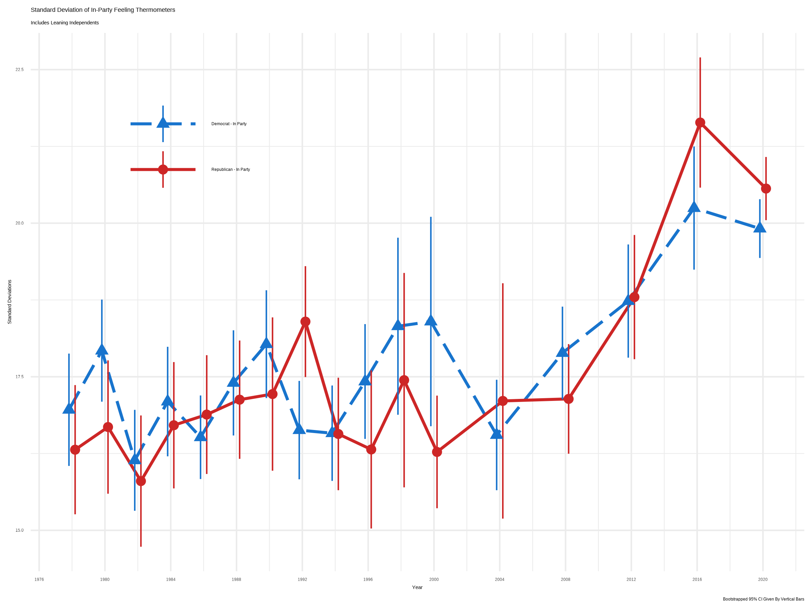

# Study Information

## Title
<!-- Provide the working title of your study. It may be the same title that you submit for publication of your final manuscript, but it is not a requirement. The title should be a specific and informative description of a project. Vague titles such as 'Fruit fly preregistration plan' are not appropriate.

Example: Effect of sugar on brownie tastiness. -->


 
`r rmarkdown::metadata$title`


<!-- ## Description
 Please give a brief description of your study, including some background, the purpose of the of the study, or broad research questions. The description should be no longer than the length of an abstract. It can give some context for the proposed study, but great detail is not needed here for your preregistration.

Example: Though there is strong evidence to suggest that sugar affects taste preferences, the effect has never been demonstrated in brownies. Therefore, we will measure taste preference for four different levels of sugar concentration in a standard brownie recipe to determine if the effect exists in this pastry. -->

## Introduction

In 2008, despite her position as Democratic standard-bearer, supporters of Hillary Clinton's primary campaign were colder towards their party than any other group of Democratic primary voters on the ANES 100-point Feeling Thermometer. Clinton's defeat by Barack Obama in June of 2008 spawned the "Party Unity My Ass" movement, which engaged in various forms of protest against the DNC and pledging *en masse* not to support the (relative) party outsider Barack Obama in the general election^[https://www.washingtonpost.com/wp-dyn/content/article/2008/06/26/AR2008062604162.html?tid=a_inl_manual].
Clinton supporters' posture towards their party in 2016 bore little semblance to that of the '08 race. Bernie Sanders---a former independent and self-identified socialist---leaned into the role of an insurgent, anti-establishment candidate; predicating his campaign on a conflict between the working-class and the elites of both major parties. Sanders supporters, angry with the DNC and reluctant to support Clinton in November led a loosely organized movement of Democratic party discontents to found groups like *Justice Democrats* and expand membership of organizations like the *Democratic Socialists of America* and various state and local progressive caucuses to protest perceived slights by the party establishment and support further left and anti-establishment down-ballot candidates. 

This is not particularly surprising on its own. Sanders campaigned against the party establishment---it is not a stretch that he would attract those disillusioned or unhappy with the party. The story is more complicated. Republican supporters of Donald Trump---whose campaign was even more exuberantly hostile towards the Republican party than Sanders' was toward the Democrats---were *warmer* towards their party than any other candidates' supporters, despite the mutual hostility between Trump and established Republican elites. As shown in Fig. 1, supporters of winning candidates tend to be warmer towards their own party than are losers---there is little difference in distributions of out-party affect.


Primary elections are substantively significant events, allowing partisans a voice in the presentation and direction of their party. In a political environment in which the presidential nominee becomes the *de facto* leader of the party, the primary process affords non-elite voters a voice in the ideological, political, and stylistic future of the party. The political products offered by primary candidates may reflect (or drive) extant divisions in the party. [@wronski2018tale] and [@bankert2020authoritarian] find that those scoring highly on measures authoritarian personality traits use their primary vote to "protect" their party from factions they see as threatening group cohesion. Just as voters do not toss a coin to decide their general election vote, they do not randomly select their choice in the primary; these choices are likely to be meaningful&mdash;or to become meaningful, if not as matters of issue-ideology but of political identity.

In general elections, candidates' party identification acts as an efficient heuristic under an ideologically sorted elite environment by which voters can base their evaluations of a candidate [@rohde1991parties]. Of course, in a primary the party ID heuristic is largely meaningless; all candidates in the race (barring an open or jungle primary system) share a party. Candidates must therefore work to differentiate each other from their opponents.

### Primary Vote as an Independent Variable

Vote choice&mdash;or preference for a candidate more generally&mdash;are most often analyzed as the outcome of (potential) voters' preferences and evaluations of candidates' attributes. That primary voters choose their candidate in part to safeguard group cohesion in their party [@wronski2018tale; @bankert2020authoritarian] raises the question: what happens to the group when candidates lose? How do partisans react when the preferences of some in the party are advantaged above their own? Scholars of policy feedback have found citizens who perceive themselves as being cut out of government decision making processes to be more disaffected and less participatory in democratic political activities [@soss1999lessons; @bruch2010policy]. Not only do individuals assess individual programs and actors on the basis of their (perceived) inclusiveness, assessments of individuals' own roles and place in political society are conditioned in part by signals they receive from political and policy actors [@campbell2012policy]. I argue that this is likely to hold true in the context of primary elections. Primary voters who perceive their party working against their preferred candidate should become more distrusting of political elites and display less affinity for their own party. 

Party elites may not be *government* policymakers or bureaucrats, but they are certainly *political* actors; their sphere of policy influence is simply constrained to the internal workings of one party&mdash;not the government writ-large. It is unlikely that the blurry distinction between "government" and "political" matters all that much to the rationally ignorant median voter as they assimilate political information and update their evaluations of elites and themselves. Moreover, government employees and party apparatchiks each wield considerable power shaping possible policy outcomes. Insofar as disaffection stems from being "cut out" of the policy process it is not clear that the legal distinction between government and party *should* be affectively salient to observers, political sophisticates or not. Further, primary elections are programs designed and implemented by a vast bureaucracy of national and state parties, private information systems providers, federal government regulators, and local supervisors of elections; structurally similar to many federated programs, even if the primary bureaucracy only becomes salient to the public every two or four years at best. 

In light of these structural similarities, it is worth asking how well insights from the policy feedback literature travel to the context of candidate selection. Theoretically, public perceptions of exclusionary politicking or unfair treatment of candidates by party elites should depress voters' assessment of the nominating process and their affection for the party. Such perceptions signal to the individual both that they hold little power in the nominating process and that those partisan actors who are powerful do not represent the interests of the powerless primary voter in question. In a policy feedback framework, the primary voter perceives a top-heavy, paternalistic party organization and has internalized their own un-belonging within that organization. Concomitant with their declining trust, disaffected partisans have little incentive (whether material or group-motivated) to participate in political activity.

In the presidential context, a primary loss is a rebuke of the preferences of losers supporters and the ascension of the representative of an *outgroup* to the station *de facto* leader of the *in-party*. During the primary season, a primary voter's in-group is not only their fellow Democrats or Republicans, but fellow Sanders, Warren, Buttigieg; Trump, Cruz, and Rubio voters as well. Those supporters of the opposing primary candidates then constitute an out-group *within* the party, the salience of which is endogenous to the affective tenor of the primary and the degree to which the candidates distinguish themselves from the opposition.


Supporters of winning primary candidates should grow more fond of their party, while losers should become more disdainful, increasing the variance of in-party affective evaluations. Indeed, macro-level trends in partisan affect have shown modest declines in mean in-party affect, concurrent with increasing variance *around* that mean, particularly from 2004--2016, a period during which major-party primary campaign expenditures ballooned from $\approx \$700'000'000$ to more than $\$2'000'000'000$. 


In sum, observational data at both the macro and individual levels is consistent with our expectations given a causal relationship between primary election outcomes and individuals' partisan affect, but the data here cannot convincingly tell a causal story. To that end, I propose the following experiment. 


## Hypotheses
<!-- List specific, concise, and testable hypotheses. Please state if the hypotheses are directional or non-directional. If directional, state the direction. A predicted effect is also appropriate here. If a specific interaction or moderation is important to your research, you can list that as a separate hypothesis.

Example: If taste affects preference, then mean preference indices will be higher with higher concentrations of sugar. -->

If primary election results affect intra-party affect, those who support losing candidates will be colder towards their party.

# Design Plan
<!-- In this section, you will be asked to describe the overall design of your study. Remember that this research plan is designed to register a single study, so if you have multiple experimental designs, please complete a separate preregistration. -->


## Study type

**Experiment**


## Blinding
<!-- Blinding describes who is aware of the experimental manipulations within a study. Select all that apply. Is there any additional blinding in this study? -->

Subjects will not be aware of the experimental design, nor of their status in a treatment/control group.

## Study design
<!-- Describe your study design. Examples include two-group, factorial, randomized block, and repeated measures. Is it a between (unpaired), within-subject (paired), or mixed design? Describe any counterbalancing required. Typical study designs for observation studies include cohort, cross sectional, and case-control studies.

This question has a variety of possible answers. The key is for a researcher to be as detailed as is necessary given the specifics of their design. Be careful to determine if every parameter has been specified in the description of the study design. There may be some overlap between this question and the following questions. That is OK, as long as sufficient detail is given in one of the areas to provide all of the requested information. For example, if the study design describes a complete factorial, 2 X 3 design and the treatments and levels are specified previously, you do not have to repeat that information.

Example: We have a between subjects design with 1 factor (sugar by mass) with 4 levels. -->

The experiment is a between-subjects design with a single treatment. 

1. First, participants' sincere party ID is solicited. Following @klar2016independent, a participant will be defined as a "partisan" if they indicate being registered with a party or *leaning* towards one party or the other. True independents will be excluded from the study.
2. Next, participants will be shown short vignettes of 10 policy positions of two counterfactual candidates, "Candidate A" and "Candidate B", running against each other in a congressional primary. 
    - The participants will not be informed that the candidates are counterfactual. 
    - The vignettes will be presented side-by-side, policy positions of each candidate will be randomized from a list of 20 neutrally worded positions. Democratic and Republican positions will be drawn from different lists.
    - The participant will have one minute to review the vignettes.
    - To ensure that participants do not attempt to consult outside information about the candidates, no identifying information about the candidates will be presented.
3. After reviewing the vignettes, the participant is asked which candidate they prefer. After making their choice, subjects are asked to write one or two sentences explaining what they find appealing about the candidate.

1. Subjects in the treatment group are told that their candidate lost the election, candidates in the control group are presented with a brief loading screen. Can also say they lost a poll of other Democrats/Republicans

4. Finally, each group is asked to rate their preferred party (whichever party the participant indicated a preference for at the beginning of the experiment) on the same 0-100 feeling thermometer scale.

5. After the second partisan rating, the participant is debriefed that the candidate and election were counterfactual, at which point the session concludes.


## Randomization
<!-- If you are doing a randomized study, how will you randomize, and at what level? Typical randomization techniques include: simple, block, stratified, and adaptive covariate randomization. If randomization is required for the study, the method should be specified here, not simply the source of random numbers.

Example: We will use block randomization, where each participant will be randomly assigned to one of the four equally sized, predetermined blocks. The random number list used to create these four blocks will be created using the web applications available at https://random.org. -->

The candidate policy positions presented to the participants will be randomized.

# Sampling Plan
<!-- In this section we’ll ask you to describe how you plan to collect samples, as well as the number of samples you plan to collect and your rationale for this decision. Please keep in mind that the data described in this section should be the actual data used for analysis, so if you are using a subset of a larger dataset, please describe the subset that will actually be used in your study. -->

Experimental data will be collected using Amazon Mechanical Turk. A random sample of voting age Americans will be requested.

## Existing data
<!-- Preregistration is designed to make clear the distinction between confirmatory tests, specified prior to seeing the data, and exploratory analyses conducted after observing the data. Therefore, creating a research plan in which existing data will be used presents unique challenges. Please select the description that best describes your situation. Please do not hesitate to contact us if you have questions about how to answer this question (prereg@cos.io). -->

**Registration prior to creation of data**. As of the date of submission of this research plan for preregistration, the data have not yet been collected, created, or realized. 


## Explanation of existing data
<!-- If you indicate that you will be using some data that already exist in this study, please describe the steps you have taken to assure that you are unaware of any patterns or summary statistics in the data. This may include an explanation of how access to the data has been limited, who has observed the data, or how you have avoided observing any analysis of the specific data you will use in your study.

An appropriate instance of using existing data would be collecting a sample size much larger than is required for the study, using a small portion of it to conduct exploratory analysis, and then registering one particular analysis that showed promising results. After registration, conduct the specified analysis on that part of the dataset that had not been investigated by the researcher up to that point.

Example: An appropriate instance of using existing data would be collecting a sample size much larger than is required for the study, using a small portion of it to conduct exploratory analysis, and then registering one particular analysis that showed promising results. After registration, conduct the specified analysis on that part of the dataset that had not been investigated by the researcher up to that point. -->

The only data that have been analyzed prior to registration are time-series data from the American National Election Study and Annenburg Center for Public Policy. No experimental data have been collected and the existing data will not be included in experimental analyses. Please see introduction for further discussion.

## Data collection procedures
<!-- Please describe the process by which you will collect your data. If you are using human subjects, this should include the population from which you obtain subjects, recruitment efforts, payment for participation, how subjects will be selected for eligibility from the initial pool (e.g. inclusion and exclusion rules), and your study timeline. For studies that donÍt include human subjects, include information about how you will collect samples, duration of data gathering efforts, source or location of samples, or batch numbers you will use.

The answer to this question requires a specific set of instructions so that another person could repeat the data collection procedures and recreate the study population. Alternatively, if the study population would be unable to be reproduced because it relies on a specific set of circumstances unlikely to be recreated (e.g., a community of people from a specific time and location), the criteria and methods for creating the group and the rationale for this unique set of subjects should be clear.

Example: Participants will be recruited through advertisements at local pastry shops. Participants will be paid $10 for agreeing to participate (raised to $30 if our sample size is not reached within 15 days of beginning recruitment). Participants must be at least 18 years old and be able to eat the ingredients of the pastries. -->

Participants will be recruited from Amazon's Mechanical Turk system.

## Sample size
<!-- Describe the sample size of your study. How many units will be analyzed in the study? This could be the number of people, birds, classrooms, plots, interactions, or countries included. If the units are not individuals, then describe the size requirements for each unit. If you are using a clustered or multilevel design, how many units are you collecting at each level of the analysis? For some studies, this will simply be the number of samples or the number of clusters. For others, this could be an expected range, minimum, or maximum number.

Example: Our target sample size is 280 participants. We will attempt to recruit up to 320, assuming that not all will complete the total task. -->

I aim to sample as many participants as possible with a budget constraint of $500. I expect this to be approximately 1000 participants.

## Sample size rationale
<!-- This could include a power analysis or an arbitrary constraint such as time, money, or personnel. This gives you an opportunity to specifically state how the sample size will be determined. A wide range of possible answers is acceptable; remember that transparency is more important than principled justifications. If you state any reason for a sample size upfront, it is better than stating no reason and leaving the reader to "fill in the blanks." Acceptable rationales include: a power analysis, an arbitrary number of subjects, or a number based on time or monetary constraints.

Example: We used the software program G*Power to conduct a power analysis. Our goal was to obtain .95 power to detect a medium effect size of .25 at the standard .05 alpha error probability. -->


See above.

## Stopping rule
<!-- If your data collection procedures do not give you full control over your exact sample size, specify how you will decide when to terminate your data collection. 

You may specify a stopping rule based on p-values only in the specific case of sequential analyses with pre-specified checkpoints, alphas levels, and stopping rules. Unacceptable rationales include stopping based on p-values if checkpoints and stopping rules are not specified. If you have control over your sample size, then including a stopping rule is not necessary, though it must be clear in this question or a previous question how an exact sample size is attained.

Example: We will post participant sign-up slots by week on the preceding Friday night, with 20 spots posted per week. We will post 20 new slots each week if, on that Friday night, we are below 320 participants. -->

I will stop collecting when the Mturk budget is depleted.


# Variables
<!-- In this section you can describe all variables (both manipulated and measured variables) that will later be used in your confirmatory analysis plan. In your analysis plan, you will have the opportunity to describe how each variable will be used. If you have variables which you are measuring for exploratory analyses, you are not required to list them, though you are permitted to do so. -->


## Manipulated variables
<!-- Describe all variables you plan to manipulate and the levels or treatment arms of each variable. This is not applicable to any observational study. For any experimental manipulation, you should give a precise definition of each manipulated variable. This must include a precise description of the levels at which each variable will be set, or a specific definition for each categorical treatment. For example, “loud or quiet,” should instead give either a precise decibel level or a means of recreating each level. 'Presence/absence' or 'positive/negative' is an acceptable description if the variable is precisely described.

Example: We manipulated the percentage of sugar by mass added to brownies. The four levels of this categorical variable are: 15%, 20%, 25%, or 40% cane sugar by mass. -->

1. Candidate policy positions are randomized. I do not intend to analyze policy effects and no hypotheses are generated regarding policy positions.

1. After recording the participant's candidate preference, I either:
    a. Inform the participant that their candidate lost the election
    b. Provide no additional information.

## Measured variables
<!-- Describe each variable that you will measure. This will include outcome measures, as well as any predictors or covariates that you will measure. You do not need to include any variables that you plan on collecting if they are not going to be included in the confirmatory analyses of this study.

Observational studies and meta-analyses will include only measured variables. As with the previous questions, the answers here must be precise. For example, 'intelligence,' 'accuracy,' 'aggression,' and 'color' are too vague. Acceptable alternatives could be 'IQ as measured by Wechsler Adult Intelligence Scale' 'percent correct,' 'number of threat displays,' and 'percent reflectance at 400 nm.'

Example: The single outcome variable will be the perceived tastiness of the single brownie each participant will eat. We will measure this by asking participants ‘How much did you enjoy eating the brownie’ (on a scale of 1-7, 1 being 'not at all', 7 being 'a great deal') and 'How good did the brownie taste' (on a scale of 1-7, 1 being 'very bad', 7 being 'very good'). -->

1. Partisanship. final sample will be limited to Democrats (Democrat leaning independents) and Republicans (Republican leaning independents).

2. Initial partisan feeling thermometer. 0 (very cold) 100 (very warm)

3. Preference for one of two counterfactual congressional candidates in a primary election.

1. The stated explanation for each participant's preference. This will be a free-response text item.
  
4. Final partisan feeling thermometer. 0 (very cold) 100 (very warm)


## Indices
<!-- If any measurements are  going to be combined into an index (or even a mean), what measures will you use and how will they be combined? Include either a formula or a precise description of your method. If your are using a more complicated statistical method to combine measures (e.g. a factor analysis), you can note that here but describe the exact method in the analysis plan section.

If you are using multiple pieces of data to construct a single variable, how will this occur? Both the data that are included and the formula or weights for each measure must be specified. Standard summary statistics, such as "means" do not require a formula, though more complicated indices require either the exact formula or, if it is an established index in the field, the index must be unambiguously defined. For example, "biodiversity index" is too broad, whereas "Shannon’s biodiversity index" is appropriate.

Example: We will take the mean of the two questions above to create a single measure of 'brownie enjoyment.'  -->

`NA`


# Analysis Plan
<!-- You may describe one or more confirmatory analysis in this preregistration. Please remember that all analyses specified below must be reported in the final article, and any additional analyses must be noted as exploratory or hypothesis generating.

A confirmatory analysis plan must state up front which variables are predictors (independent) and which are the outcomes (dependent), otherwise it is an exploratory analysis. You are allowed to describe any exploratory work here, but a clear confirmatory analysis is required. -->


## Statistical models
<!-- What statistical model will you use to test each hypothesis? Please include the type of model (e.g. ANOVA, multiple regression, SEM, etc) and the specification of the model (this includes each variable that will be included as predictors, outcomes, or covariates). Please specify any interactions, subgroup analyses, pairwise or complex contrasts, or follow-up tests from omnibus tests. If you plan on using any positive controls, negative controls, or manipulation checks you may mention that here. Remember that any test not included here must be noted as an exploratory test in your final article.

This is perhaps the most important and most complicated question within the preregistration. As with all of the other questions, the key is to provide a specific recipe for analyzing the collected data. Ask yourself: is enough detail provided to run the same analysis again with the information provided by the user? Be aware for instances where the statistical models appear specific, but actually leave openings for the precise test. See the following examples:

- If someone specifies a 2x3 ANOVA with both factors within subjects, there is still flexibility with the various types of ANOVAs that could be run. Either a repeated measures ANOVA (RMANOVA) or a multivariate ANOVA (MANOVA) could be used for that design, which are two different tests. 
- If you are going to perform a sequential analysis and check after 50, 100, and 150 samples, you must also specify the p-values you’ll test against at those three points.

Example:  We will use a one-way between subjects ANOVA to analyze our results. The manipulated, categorical independent variable is 'sugar' whereas the dependent variable is our taste index. -->

The statistical model to be implemented is a simple t-test of:

$\mu[i_{1}(2) - i_{1}(1)] - \mu[i_{0}(2) - i_{0}(1)]$

or, the difference-in-difference of feeling thermometers ratings between treated and non-treated participants. The hypothesis will be supported when the above quantity is negative, indicating that the partisan warmth of the treated group declined more than their untreated co-participants between measurement.

```{r}
library(pwr)

expected_cohen_d <- ((70-80)/15)

pwr.t.test(n = 300, d = .25, sig.level = 0.05, power = NULL, alternative = "two.sided", type = "two.sample") #underestimating d


```

## Transformations
<!-- If you plan on transforming, centering, recoding the data, or will require a coding scheme for categorical variables, please describe that process. If any categorical predictors are included in a regression, indicate how those variables will be coded (e.g. dummy coding, summation coding, etc.) and what the reference category will be.

Example: The "Effect of sugar on brownie tastiness" does not require any additional transformations. However, if it were using a regression analysis and each level of sweet had been categorically described (e.g. not sweet, somewhat sweet, sweet, and very sweet), 'sweet' could be dummy coded with 'not sweet' as the reference category. -->

No additional transformations are necessary.

## Inference criteria
<!-- What criteria will you use to make inferences? Please describe the information youÍll use (e.g. p-values, bayes factors, specific model fit indices), as well as cut-off criterion, where appropriate. Will you be using one or two tailed tests for each of your analyses? If you are comparing multiple conditions or testing multiple hypotheses, will you account for this?

p-values, confidence intervals, and effect sizes are standard means for making an inference, and any level is acceptable, though some criteria must be specified in this or previous fields. Bayesian analyses should specify a Bayes factor or a credible interval. If you are selecting models, then how will you determine the relative quality of each? In regards to multiple comparisons, this is a question with few "wrong" answers. In other words, transparency is more important than any specific method of controlling the false discovery rate or false error rate. One may state an intention to report all tests conducted or one may conduct a specific correction procedure; either strategy is acceptable.

Example: We will use the standard p<.05 criteria for determining if the ANOVA and the post hoc test suggest that the results are significantly different from those expected if the null hypothesis were correct. The post-hoc Tukey-Kramer test adjusts for multiple comparisons. -->

I will use the standard $p<.05$ criteria to determine if the difference in feeling thermometer between treatment and control groups is statistically significant.


## Data exclusion
<!-- How will you determine what data or samples, if any, to exclude from your analyses? How will outliers be handled? Will you use any awareness check? Any rule for excluding a particular set of data is acceptable. One may describe rules for excluding a participant or for identifying outlier data.

Example: No checks will be performed to determine eligibility for inclusion besides verification that each subject answered each of the three tastiness indices. Outliers will be included in the analysis. -->

I will exclude any participant who does not identify themselves as a partisan or partisan-leaning independent.


## Missing data
<!-- How will you deal with incomplete or missing data? Any relevant explanation is acceptable. As a final reminder, remember that the final analysis must follow the specified plan, and deviations must be either strongly justified or included as a separate, exploratory analysis.

Example: If a subject does not complete any of the three indices of tastiness, that subject will not be included in the analysis. -->

Participants who do not complete the experiment will be excluded from the analysis.


## Exploratory analyses (optional)
<!-- If you plan to explore your data set to look for unexpected differences or relationships, you may describe those tests here. An exploratory test is any test where a prediction is not made up front, or there are multiple possible tests that you are going to use. A statistically significant finding in an exploratory test is a great way to form a new confirmatory hypothesis, which could be registered at a later time.

Example: We expect that certain demographic traits may be related to taste preferences. Therefore, we will look for relationships between demographic variables (age, gender, income, and marital status) and the primary outcome measures of taste preferences. -->

Exploratory analysis of descriptive data from the American National Election Study and National Anennenburg Elections Study have been conducted ahead of time (as discussed in the introduction), and suggest a descriptive relationship between primary outcomes and partisan affect. No experimental data analysis has been conducted thus far.

# Other

## Other (Optional)
<!-- If there is any additional information that you feel needs to be included in your preregistration, please enter it here. Literature cited, disclosures of any related work such as replications or work that uses the same data, or other context that will be helpful for future readers would be appropriate here. -->

Enter your response here.


# References
## 
\vspace{-2pc}
\setlength{\parindent}{-0.5in}
\setlength{\leftskip}{-1in}
\setlength{\parskip}{8pt}
\noindent
